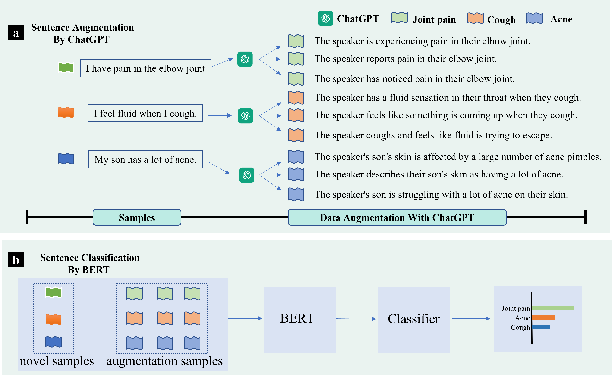

# AugGPT: Leveraging ChatGPT for Text Data Augmentation
\[In submission\] Code for: [AugGPT: Leveraging ChatGPT for Text Data Augmentation](https://arxiv.org/abs/2302.13007)

Text data augmentation is an effective strategy for overcoming the challenge of limited sample sizes in many natural language processing (NLP) tasks. This challenge is especially prominent in the few-shot learning scenario, where the data in the target domain is generally much scarcer and of lowered quality. A natural and widely-used strategy to mitigate such challenges is to perform data augmentation to better capture the data invariance and increase the sample size. However, current text data augmentation methods either can’t ensure the correct labeling of the generated data (lacking faithfulness) or can’t ensure sufficient diversity in the generated data (lacking compactness), or both. Inspired by the recent success of large language models, especially the development of ChatGPT, which demonstrated improved language comprehension abilities, in this work, we propose a text data augmentation approach based on ChatGPT (named AugGPT). AugGPT rephrases each sentence in the training samples into multiple conceptually similar but semantically different samples. The augmented samples can then be used in downstream model training. Experiment results on few-shot learning text classification tasks show the superior performance of the proposed AugGPT approach over state-of-the-art text data augmentation methods in terms of testing accuracy and distribution of the augmented samples.

Our framework is as follows.

</img>

## Environment

To set up the environment, you can:
1. Simply using the `pip install -r requirments.txt`  or 
2. Using the docker provided by us. The docker's tag is **harolddai/mask_bert:v1.1**

## Dataset 
All the dataset are public dataset, you can download them in the official webset. After downloaded the dataset, please put then under **data** folder.

## How to run

In this repo, we combined all the models used in our abalation study. First, you need pretrain our model, then you can train any model provided by us. 

To run the pretrain Model first:

    python mask_bert.py --task pretrain --cuda {cuda_id} --dataset {dataset_name}  

To run the model/method with one dataset.:
    
    python mask_bert.py --task {task_name} --cuda {cuda_id} --dataset {dataset_name} 

For different task and other hyperparameter, you can refer the scripts under the **scripts** folder. All the results will saved in result folder. 

